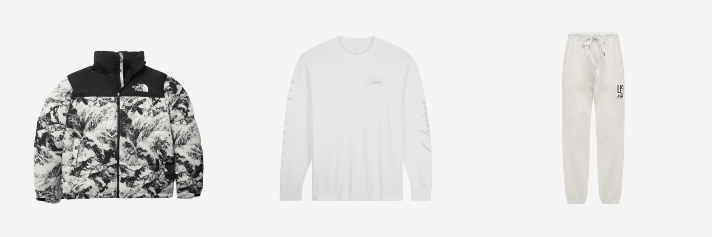
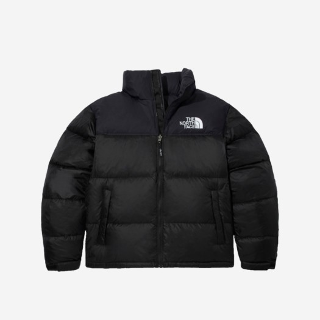

# KREAM-Product-Generator
Let's easily fine-tuning a pre-trained Stable Diffusion XL using `dataset-maker` and [LoRA](https://github.com/cloneofsimo/lora)!

**KREAM-Product-Generator** is a finetuned text-to-image generative model with a custom dataset collected from [KREAM](https://kream.co.kr/), one of the best online-resell market in Korea.
Have fun creating realistic, high-quality fashion items!

## Dependencies

- python <= 3.11
- PyTorch 2.1.0
- Hugging Face 🤗: diffusers, transformers, datasets

I tested the conda environments on Linux, CUDA version 12.0, and NVIDIA Drivier Version 525.125.06.

****Please refer to [environment.yml](./environment.yml) for more details.***

```cd easy-finetuning-stable-diffusion```

```conda env create -f environment.yml```

```conda activate efsd```

```
pip install git+https://github.com/huggingface/diffusers
```

## dataset-maker Instructions

***KREAM Product Dataset Examples Collected by*** `dataset-maker`



`dataset-maker` is an example for a custom data collection tool to finetune the Stable Diffusion. It consists of web crawler and [BLIP image captioning module](https://github.com/salesforce/BLIP).

### KREAM Product Dataset from Hugging Face

[KREAM Product Blip Captions Dataset](https://huggingface.co/datasets/hahminlew/kream-product-blip-captions) is now available in Hugging Face 🤗.

```
from datasets import load_dataset

dataset = load_dataset("hahminlew/kream-product-blip-captions", split="train")
sample = dataset[0]
display(sample["image"].resize((256, 256)))
print(sample["text"])
```



```
outer, The North Face 1996 Eco Nuptse Jacket Black, a photography of the north face black down jacket
```

### Download KREAM Product Dataset from Scratch

1. Move [dataset.json](./dataset.json) file into desired save directory for KREAM Product Dataset.

```
mv ./dataset.json [/path/to/save]
```

```cd dataset-maker```

2. Run `download_KREAM.py`.

```
python download_KREAM.py --save_dir [/path/to/save]
```

3. Run `BLIP_captioning.py`. 

```
CUDA_LAUNCH_BLOCKING=1 python BLIP_captioning.py --dataset_dir [/path/to/dataset] --use_condition --text_condition 'a photography of'
```

BLIP captioning results will be saved in /path/to/save/[dataset_BLIP.json](./dataset_BLIP.json)

### Try Your Own Dataset Creation

```cd dataset-maker```

1. Inspect your desired website and slightly modify `webCrawler.py`.

**Please exercise caution when web crawling. Make sure to adhere to the website's crawling policies, which can be found in the '/robots.txt'.*

2. Run a modified `webCrawler.py`.

```
python webCrawler.py
```

3. Run `BLIP_captioning.py`.

```
CUDA_LAUNCH_BLOCKING=1 python BLIP_captioning.py --dataset_dir [/path/to/dataset] --use_condition --text_condition 'a photography of'
```

## Finetuning Stable Diffusion Instructions

I utilized `Hugging Face Diffusers Text-to-Image Examples` for finetuning a pre-trained Stable Diffusion XL with [LoRA](https://github.com/cloneofsimo/lora).

```cd finetuning```

```
sudo chmod +x run.sh
```

```
./run.sh
```

**Make sure you have Hugging Face and wandb account. You should create a directory and personal tokens for Hugging Face. Also, please check your personal API keys for wandb.*

## References

- [BLIP image captioning](https://github.com/salesforce/BLIP) and [BLIP Hugging Face Demo](https://huggingface.co/Salesforce/blip-image-captioning-large)
- [Hugging Face Dataset Creation Tutorial](https://huggingface.co/docs/datasets/create_dataset)
- [LoRA: Low-rank Adaptation for Fast Text-to-Image Diffusion Fine-tuning](https://github.com/cloneofsimo/lora)
- [Using LoRA for Efficient Stable Diffusion Fine-Tuning](https://huggingface.co/blog/lora)
- [Hugging Face Diffusers Text-to-Image Examples](https://github.com/huggingface/diffusers/tree/main/examples/text_to_image)
- [Finetuning Stable Diffusion from Lambda Labs ML](https://github.com/justinpinkney/stable-diffusion)